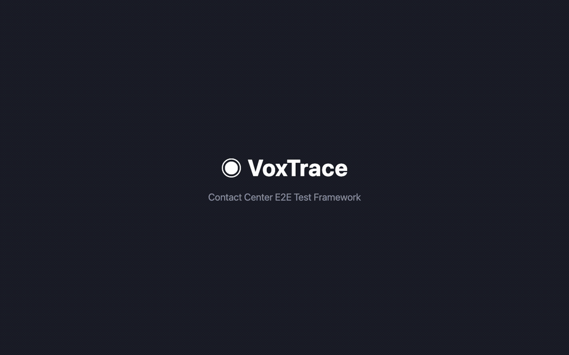

# Audrique — Agentic Voice Testing for Contact Centers

[](LICENSE)
[](https://nodejs.org)
[](https://playwright.dev)
[](https://www.salesforce.com/products/service-cloud-voice/)

**Agentic AI-ready end-to-end testing framework for enterprise contact centers.** Autonomously orchestrates real voice calls, multi-browser CRM verification, and telephony API validation — all in a single declarative test scenario.

> The first open-source tool that tests across telephony, CRM UI, and backend records simultaneously — no mocks, no stubs, real calls.



*Scenario Studio visual builder + live E2E test execution against Salesforce Service Cloud Voice + Amazon Connect.*

---

## Why Agentic Testing?

Traditional contact center testing is **manual, slow, and siloed**. Each tool covers one layer:

| Traditional Approach | Limitation |
|---------------------|------------|
| **UI tools** (Provar, Selenium) | Test the CRM, can't place real calls |
| **Telephony tools** (Twilio scripts) | Make calls, can't verify what the agent sees |
| **API tools** (Postman) | Query records, can't coordinate timing |
| **Manual QA** | Expensive, slow, non-reproducible |

**Audrique is an autonomous testing agent** that orchestrates all three layers in parallel — because contact center bugs live at the boundaries between systems.

```
┌──────────────────────────────────────────────────────────────────────┐
│                      AGENTIC ORCHESTRATION                           │
│                                                                      │
│   Caller dials → IVR navigation → Agent accepts → Screen pop → ACW  │
│        ↑               ↑               ↑              ↑         ↑   │
│     Twilio/CCP    DTMF/Prompt      Playwright     SF SOQL    Connect│
│    (telephony)    (voice AI)      (browser UI)   (backend)    (CTR)  │
│                                                                      │
│   3 parallel browser agents + 1 call agent + backend verification    │
└──────────────────────────────────────────────────────────────────────┘
```

## Key Capabilities

| Capability | Description |
|------------|-------------|
| **Autonomous call orchestration** | Places real calls via Connect CCP (Twilio beta), navigates IVR menus with DTMF |
| **Multi-agent browser verification** | 3 parallel Playwright sessions (Agent, CCP, Supervisor) |
| **Declarative scenario DSL** | JSON-based scenarios — no code to write |
| **Visual Scenario Studio** | Drag-and-drop wizard builds scenarios at localhost:4200 |
| **Org auto-discovery** | SOQL-powered discovery of queues, skills, routing, business hours |
| **Video evidence capture** | Parallel recording + FFmpeg merge with speed modulation and annotations |
| **Natural language authoring** | Gherkin-style test authoring compiled to executable JSON |
| **Enterprise security** | Vault integration, zero plaintext secrets, session isolation |
| **CI/CD ready** | Headless execution, structured JSON results, exit codes |

## What You Can Test

| Scenario Type | What It Validates |
|---------------|-------------------|
| Inbound call + agent accept | Call routes correctly, screen pop appears, VoiceCall record created |
| IVR navigation (single/multi-level) | DTMF routing, queue assignment, timeout fallback |
| Skill-based routing | Agent skills matched, PendingServiceRouting records correct |
| Supervisor observation | Queue monitoring, agent offer visibility in Command Center |
| Business hours / closed message | After-hours routing, system prompt, auto-disconnect |
| Voicemail | No-agent fallback, voicemail recorded, SF record created |
| Callback | Queue-full handling, callback task created in Salesforce |
| Real-time transcript | Speech captured, transcript panel updates live |
| Hold / resume / ACW | Full call lifecycle with disposition |

## Architecture

```
┌──────────────────────────────────────────────────────────────────────┐
│                          Scenario Studio                              │
│         Visual wizard for building test scenarios (localhost:4200)     │
│      IVR flowchart builder | Skill routing | Business hours | NLP     │
└────────────────────────┬─────────────────────────────────────────────┘
                         │ declarative JSON v2
                         ▼
┌──────────────────────────────────────────────────────────────────────┐
│                        Agentic Scenario Runner                        │
│        Reads v2 JSON → orchestrates parallel agents → assertions      │
│     Step-based execution | Timeline capture | Video evidence          │
└──────┬──────────────────┬──────────────────┬─────────────────────────┘
       │                  │                  │
       ▼                  ▼                  ▼
┌─────────────┐   ┌──────────────┐   ┌─────────────────┐
│ Call Agent   │   │ Browser      │   │ Backend          │
│              │   │ Agents (x3)  │   │ Verifier         │
│ - Twilio API │   │              │   │                  │
│ - CCP Dialer │   │ - SF Agent   │   │ - SF SOQL        │
│ - DTMF Nav   │   │ - CCP Panel  │   │ - Connect CTR    │
│ - IVR Prompt │   │ - Supervisor │   │ - VoiceCall      │
│              │   │ - Screen Pop │   │ - AgentWork      │
│              │   │ - Transcript │   │ - PSR Records    │
└─────────────┘   └──────────────┘   └─────────────────┘
       │                  │                  │
       └──────────────────┼──────────────────┘
                          ▼
              ┌─────────────────────┐
              │  Evidence Pipeline   │
              │  Video merge (FFmpeg)│
              │  Timeline + banners  │
              │  Highlight reels     │
              │  Annotated demos     │
              └─────────────────────┘
```

**Four autonomous agents** work in parallel during each test:
1. **Call Agent** — Places real calls via Connect CCP (Twilio beta), sends DTMF, navigates IVR
2. **SF Agent Browser** — Salesforce console (Omni-Channel status, phone utility, screen pop, transcript)
3. **CCP Agent Browser** — Amazon Connect softphone (dial confirmation, call state, hold/resume)
4. **Supervisor Browser** — Command Center (queue monitoring, agent offers, real-time metrics)

## Quick Start

### Prerequisites

- Node.js 18+
- A Salesforce org with Service Cloud Voice enabled
- Amazon Connect instance linked to the org
- (Optional) Twilio account for automated call triggering (beta — not yet fully tested)

### Install

```bash
git clone https://github.com/snehalsurti12/audrique.git
cd audrique
npm install
npx playwright install chromium
```

### Configure Your Org

```bash
cp instances/default.env.example instances/myorg.env
```

Edit `instances/myorg.env` with your Salesforce + Connect credentials. See [SETUP.md](SETUP.md) for detailed configuration.

### Capture Auth Sessions

Salesforce and Connect sessions are captured once, then reused for headless runs:

```bash
# Capture Salesforce session
INSTANCE=myorg npm run instance:auth:sf

# Capture Amazon Connect CCP session
INSTANCE=myorg npm run instance:auth:connect
```

### Run Tests

```bash
# Single inbound call test
INSTANCE=myorg npm run instance:test:ui:state

# Full E2E suite (all scenarios)
INSTANCE=myorg npm run instance:test:e2e

# V2 declarative suite (9 scenarios)
INSTANCE=myorg npm run instance:test:e2e:v2

# Dry run (validate without executing)
INSTANCE=myorg npm run instance:test:e2e:v2:dry
```

### Scenario Studio

Visual wizard for building test scenarios — no JSON editing required:

```bash
npm run studio
# Open http://localhost:4200
```

The Studio provides:
- **Suite management** — Create, rename, delete test suites from the UI
- **Connection management** — Configure Salesforce + Connect + Twilio connections with vault-backed or direct credentials
- **Vault integration** — HashiCorp Vault support with "Test Connection" verification, auto-populated secret references, and regulated mode enforcement
- Step-by-step wizard with call setup, IVR routing, agent verification
- Visual IVR flowchart builder that grows as you add menu levels
- Skill-based routing configuration with auto-discovery from your org
- Business hours, voicemail, and callback scenario builders
- Live flow preview with Gherkin-style natural language
- One-click JSON export and save to suite
- **Suite ↔ Connection binding** — Each suite is associated with a connection set, ensuring tests run against the correct org

## Declarative Scenario Format (v2)

Scenarios are defined as JSON — no code to write:

```json
{
  "id": "ivr-support-queue-branch",
  "description": "DTMF 1 routes to Support Queue",
  "callTrigger": {
    "mode": "connect_ccp",
    "ivrDigits": "1",
    "ivrInitialDelayMs": 3500
  },
  "steps": [
    { "action": "preflight" },
    { "action": "start_supervisor", "queue": "Support Queue", "observeAgentOffer": true },
    { "action": "trigger_call" },
    { "action": "detect_incoming", "timeoutSec": 120 },
    { "action": "accept_call" },
    { "action": "verify_screen_pop" }
  ],
  "expect": [
    { "type": "e2e.call_connected", "equals": true },
    { "type": "e2e.supervisor_queue_observed", "queue": "Support Queue" },
    { "type": "e2e.screen_pop_detected", "equals": true }
  ]
}
```

### Available Step Actions

| Category | Actions |
|----------|---------|
| Orchestration | `preflight`, `trigger_call`, `detect_incoming`, `accept_call`, `decline_call` |
| IVR & Prompts | `send_dtmf_sequence`, `wait_for_ivr_prompt`, `listen_for_prompt` |
| Verification | `verify_screen_pop`, `verify_transcript`, `verify_voicecall_record`, `verify_prompt_played` |
| Conversation | `play_agent_audio`, `play_caller_audio`, `wait_for_transcript`, `hold_call`, `resume_call` |
| Call Lifecycle | `end_call`, `complete_acw`, `wait_for_disconnect` |
| Voicemail/Callback | `leave_voicemail`, `request_callback`, `verify_voicemail_created`, `verify_callback_created` |
| Supervisor | `start_supervisor`, `verify_business_hours_routing` |

### Natural Language Authoring (Planned)

Write tests in plain English — compiled to executable JSON:

```text
Scenario: Unknown caller reaches Service queue
Given an unknown caller calls the support number
When caller presses 1 for Service
Then the system should offer the call to an available Service agent
And a VoiceCall record should be created in Salesforce
And the agent should see incoming toast and Accept button
```

The NL compiler maps natural language patterns to scenario DSL steps. See [docs/natural-language-authoring.md](docs/natural-language-authoring.md).

## Intelligent Org Auto-Discovery

Audrique **autonomously discovers** your Salesforce org configuration via SOQL — zero hardcoding required:

| Discovery | Source | Auto-Configured |
|-----------|--------|-----------------|
| Presence statuses | `ServicePresenceStatus` | Agent online/offline states |
| Queues | `Group WHERE Type='Queue'` | Routing targets |
| Skills | `Skill` + `ServiceResourceSkill` | Skill-based routing |
| Service channels | `ServiceChannel` | Channel configuration |
| Business hours | `OperatingHours` + `TimeSlot` | After-hours routing |
| Routing configs | `RoutingConfiguration` | Queue/skill routing |
| Queue capabilities | DOM + metadata | Voicemail/callback detection |

Discovery results are cached and used as `{{vocabulary.*}}` references in scenarios — scenarios adapt to any org without code changes.

## Video Evidence Pipeline

Three parallel recording streams captured simultaneously, merged with FFmpeg:

```bash
# Run with video capture
INSTANCE=myorg npm run instance:test:ui:state:video

# Merge recordings into evidence video
npm run merge:videos

# Create speed-modulated highlight reel from full suite run
npm run highlight:reel

# Build annotated demo video with title cards and phase annotations
node scripts/build-demo-video.mjs
```

**Evidence output** per scenario:
- Agent browser recording (Salesforce UI)
- CCP browser recording (Connect softphone)
- Supervisor browser recording (Command Center)
- Merged video with timeline-based speed modulation
- Annotated demo with phase banners and title cards

---

## Security

Audrique is built with **enterprise-grade security** as a first-class concern. No credentials ever appear in code, logs, or test artifacts.

### Zero Trust Credential Management

```
┌──────────────────────────────────────────────────────────┐
│                  Secrets Architecture                      │
│                                                           │
│   Config File          Runtime Resolution                 │
│   ─────────           ──────────────────                  │
│   SF_PASSWORD_REF  ──→  Vault / Env / SOPS  ──→  Value   │
│   AWS_SECRET_REF   ──→  Never in plaintext   ──→  Value   │
│   CONNECT_TOKEN_REF──→  Never in logs        ──→  Value   │
│                                                           │
│   .auth/ directory: gitignored, session-only              │
│   Regulated mode: blocks plaintext in config              │
└──────────────────────────────────────────────────────────┘
```

| Security Layer | Implementation |
|----------------|----------------|
| **Secret references** | All credentials use `*_REF` suffix — resolved at runtime, never stored in plaintext |
| **HashiCorp Vault** | Native integration — `SECRETS_BACKEND=vault` with path-based secret resolution |
| **Environment isolation** | Secrets resolved from `$ENV_VAR` — compatible with CI/CD secret stores |
| **Regulated mode** | `REGULATED_MODE=true` blocks any plaintext secret in config files |
| **Session isolation** | `.auth/` directory is gitignored; browser sessions captured once, reused headlessly |
| **No credential logging** | Secret values are never written to console, test results, or video evidence |
| **Org-scoped profiles** | Each instance (`instances/myorg.env`) is isolated — no cross-org credential leakage |

```bash
# Environment-backed secrets (CI/CD compatible)
SECRETS_BACKEND=env
SF_PASSWORD_REF=SF_PASSWORD_SECRET      # resolved from $SF_PASSWORD_SECRET
AWS_SECRET_REF=AWS_SECRET_ACCESS_KEY    # resolved from $AWS_SECRET_ACCESS_KEY

# HashiCorp Vault-backed secrets (enterprise)
SECRETS_BACKEND=vault
VAULT_ADDR=https://vault.internal:8200
SF_PASSWORD_REF=kv/data/voice/sf#password
AWS_SECRET_REF=kv/data/voice/aws#secret_key
```

### Compliance Considerations

- **SOC 2 / ISO 27001** — No secrets in source, audit trail via Vault
- **HIPAA / PCI** — Regulated mode prevents accidental plaintext exposure
- **GDPR** — Test data isolation per org, no PII in video evidence metadata
- **FedRAMP** — Vault-backed secrets with role-based access control

---

## AI/LLM Roadmap

Audrique is designed as an **AI-native testing platform**. The declarative scenario DSL is the foundation for LLM-powered test generation.

```
┌──────────────────────────────────────────────────────────────────┐
│                     AI-Powered Testing Vision                     │
│                                                                   │
│   ┌─────────────────┐     ┌──────────────────┐                   │
│   │  LLM Agent       │     │  Scenario DSL     │                  │
│   │  (LLM)    │────→│  (JSON v2)        │                  │
│   │                  │     │                   │                  │
│   │  "Test that DTMF │     │  Compiled,        │                  │
│   │   1 routes to    │     │  validated,        │                  │
│   │   Support Queue" │     │  executable        │                  │
│   └─────────────────┘     └────────┬───────────┘                  │
│                                     │                             │
│                                     ▼                             │
│                          ┌──────────────────┐                     │
│                          │ Agentic Runner    │                    │
│                          │ (parallel agents) │                    │
│                          └────────┬─────────┘                     │
│                                   │                               │
│                    ┌──────────────┼──────────────┐                │
│                    ▼              ▼              ▼                │
│              ┌──────────┐  ┌──────────┐  ┌──────────┐            │
│              │ Voice AI  │  │ Browser  │  │ Backend  │            │
│              │ Analysis  │  │ Vision   │  │ RAG      │            │
│              │           │  │          │  │          │            │
│              │ - STT     │  │ - Visual │  │ - SOQL   │            │
│              │ - Intent  │  │   match  │  │   gen    │            │
│              │ - Prompt  │  │ - OCR    │  │ - CTR    │            │
│              │   verify  │  │ - DOM    │  │   query  │            │
│              └──────────┘  └──────────┘  └──────────┘            │
└──────────────────────────────────────────────────────────────────┘
```

### Planned AI Capabilities

| Capability | Status | Description |
|-----------|--------|-------------|
| **NL test authoring** | Designed | Write tests in English, compile to scenario DSL |
| **LLM scenario generation** | Planned | AI generates test scenarios from org configuration |
| **Voice AI verification** | Planned | STT + intent analysis to verify IVR prompts and agent speech |
| **Visual assertion AI** | Planned | Screenshot comparison + OCR for UI verification |
| **Self-healing tests** | Planned | AI detects UI changes and auto-updates selectors |
| **Anomaly detection** | Planned | ML-based detection of routing anomalies and performance regression |
| **RAG-powered debugging** | Planned | LLM analyzes failure evidence (video, logs, timeline) to diagnose root cause |

### Why the DSL Matters for AI

The declarative JSON format is intentionally **LLM-friendly**:
- Structured, schema-validated — easy for LLMs to generate correctly
- Action-based — maps directly to natural language verbs
- Assertion-based — translatable from "should" statements
- **Platform-agnostic** — same scenario format works across Salesforce, ServiceNow, SAP, Zendesk, and future CRM/telephony providers. Write once, test anywhere.

---

## Salesforce Org Setup

Required custom fields for test correlation:

| Object | Field | Purpose |
|--------|-------|---------|
| VoiceCall | `Test_Run_Id__c` | Correlates test run to call record |
| Case | `Test_Run_Id__c` | Links generated case to test |
| AgentWork | `Test_Run_Id__c` | (Optional) Tracks routing assignment |

These fields allow Audrique to query "find the VoiceCall created by this specific test run" via SOQL.

## Project Structure

```
audrique/
├── packages/
│   ├── core/                  # Types, runner, shared interfaces
│   ├── provider-twilio/       # Twilio call provider
│   ├── verifier-salesforce/   # SOQL-based backend assertions
│   ├── verifier-connect/      # Connect CTR verifier
│   └── verifier-ui-playwright/
│       ├── sfOmniChannel.ts   # Omni-Channel status management
│       ├── sfCallDetection.ts # Incoming call detection
│       ├── sfCallAccept.ts    # Call accept automation
│       ├── sfScreenPop.ts     # VoiceCall screen pop verification
│       ├── sfTranscript.ts    # Real-time transcript capture
│       ├── sfSupervisorObserver.ts  # Supervisor queue monitoring
│       ├── sfOrgDiscovery.ts  # Auto-discovery via SOQL + DOM
│       └── connectCcpDialer.ts     # CCP softphone automation
├── scenarios/
│   ├── e2e/full-suite-v2.json # 9 declarative test scenarios
│   └── examples/              # Reference scenarios
├── webapp/                    # Scenario Studio (visual builder)
├── scripts/                   # CLI tools, auth capture, video merge
├── instances/                 # Org-specific config (gitignored)
└── docs/                      # Architecture docs, assertion catalog
```

## npm Scripts

| Script | Purpose |
|--------|---------|
| `npm run studio` | Start Scenario Studio at localhost:4200 |
| `npm run instance:test:e2e` | Run full E2E suite |
| `npm run instance:test:e2e:v2` | Run v2 declarative suite |
| `npm run instance:auth:sf` | Capture Salesforce session |
| `npm run instance:auth:connect` | Capture Connect CCP session |
| `npm run merge:videos` | Merge parallel recording streams |
| `npm run highlight:reel` | Generate highlight video from suite run |
| `npm run typecheck` | TypeScript type checking |

## Supported Platforms

**Current release** supports Salesforce Service Cloud Voice + Amazon Connect. The architecture is **platform-agnostic by design** — the declarative scenario DSL, browser automation, and evidence pipeline are CRM-independent. Adding a new platform requires only a new verifier package and browser adapter.

### Current Support (v0.1)

| Component | Technology | Status |
|-----------|------------|--------|
| CRM | Salesforce Service Cloud Voice | **GA** |
| Telephony | Amazon Connect | **GA** |
| Call Provider | Connect CCP (tested) / Twilio (beta) / Manual | **GA** |
| Browser Automation | Playwright (Chromium) | **GA** |
| Video Evidence | FFmpeg (VP9/WebM) | **GA** |
| Secret Management | HashiCorp Vault / Environment | **GA** |
| Language | TypeScript / Node.js | **GA** |
| CI/CD | Any (headless, exit codes, JSON results) | **GA** |

### Platform Roadmap

| Platform | Type | Planned | Notes |
|----------|------|---------|-------|
| **ServiceNow** CSM / ITSM | CRM | v0.3 | Agent Workspace, CTI softphone, incident screen pop |
| **SAP** Service Cloud | CRM | v0.4 | Communication center, SAP CRM UI5 verification |
| **Zendesk** Talk | CRM + Telephony | v0.4 | Talk integration, ticket screen pop, CSAT survey |
| **Microsoft Dynamics 365** | CRM | v0.5 | Omnichannel for Customer Service, Copilot |
| **Genesys Cloud CX** | Telephony | v0.3 | PureCloud dialer, predictive routing, WFM |
| **Five9** | Telephony | v0.4 | Intelligent Cloud Contact Center dialer |
| **NICE CXone** | Telephony | v0.5 | ACD routing, workforce optimization |
| **Avaya OneCloud** | Telephony | v0.5 | Avaya Experience Platform, AXP workspaces |
| **RingCentral** Contact Center | Telephony | v0.4 | RingCX dialer, skills-based routing |
| **Talkdesk** | Telephony | v0.5 | AI-powered contact center platform |

### Extensibility Architecture

```
┌──────────────────────────────────────────────────────────────────┐
│                    Platform-Agnostic Core                         │
│                                                                   │
│   Scenario DSL (JSON v2)  →  Agentic Runner  →  Evidence Pipeline│
│                                                                   │
│   ┌──────────────┐  ┌──────────────┐  ┌──────────────┐           │
│   │ CRM Adapters  │  │ Telephony    │  │ Backend      │           │
│   │               │  │ Adapters     │  │ Verifiers    │           │
│   │ ● Salesforce ✓│  │ ● Connect  ✓ │  │ ● SOQL     ✓ │          │
│   │ ○ ServiceNow  │  │ ○ Genesys    │  │ ○ ServiceNow│           │
│   │ ○ SAP         │  │ ○ Five9      │  │   REST API  │           │
│   │ ○ Zendesk     │  │ ○ NICE CXone │  │ ○ SAP OData │           │
│   │ ○ Dynamics365 │  │ ○ Avaya      │  │ ○ Zendesk   │           │
│   │               │  │ ○ RingCentral│  │   API       │           │
│   └──────────────┘  └──────────────┘  └──────────────┘           │
│                                                                   │
│   ✓ = Available now    ○ = Planned                                │
└──────────────────────────────────────────────────────────────────┘
```

Each new platform is a **drop-in package** (`packages/verifier-servicenow/`, `packages/provider-genesys/`, etc.) — no changes to core runner, DSL, or evidence pipeline required. Community contributions welcome.

## Contributing

Contributions welcome. Please:
1. Fork the repo
2. Create a feature branch
3. Follow existing code patterns
4. Test against a real Salesforce + Connect environment
5. Submit a PR with description of changes

## License

[MIT](LICENSE)

---

Built with Playwright, FFmpeg, and a lot of real phone calls.
